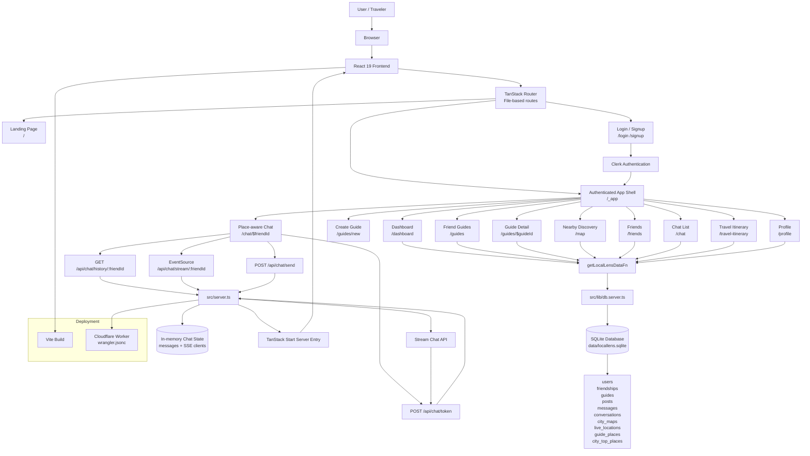
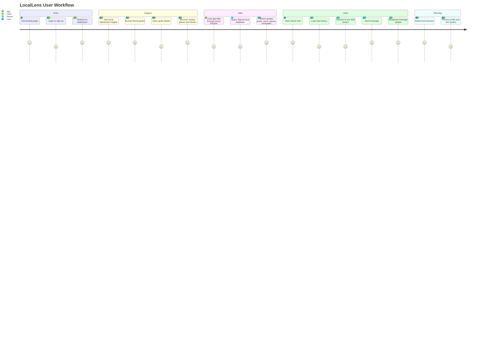
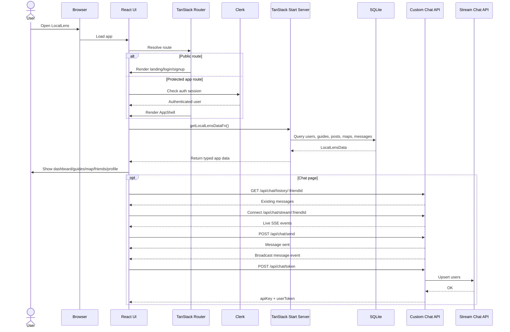

# LocalLens

LocalLens is a human-powered local travel companion that helps travelers discover trusted local insights from friends and people who know a city well. Instead of relying only on algorithmic recommendations, LocalLens focuses on friend guides, nearby local context, real-time updates, and place-aware conversations.

## Description

LocalLens is a full-stack TypeScript web application built with React and TanStack Start. The app includes a landing page, authenticated dashboard, friend guides, nearby map-style discovery, chat, profile, and local travel planning flows.

The project uses Clerk for authentication, Stream Chat credentials for chat token generation, SQLite for local development data, and Cloudflare Workers configuration for deployment.

## Architecture Diagrams

### Full Application Workflow



### User Journey



### Technical Request Flow



## Features

- User authentication with Clerk
- Landing page for the LocalLens product
- Authenticated app shell with sidebar and mobile navigation
- Dashboard with local travel insights
- Friend guides for trusted city recommendations
- Guide detail and guide creation pages
- Nearby/local discovery page
- Friends page
- Place-aware chat experience
- Travel itinerary page
- User profile page
- Dark and light theme toggle
- Local SQLite database with schema and seed data
- Server-side API handlers for chat token, chat history, chat stream, and chat send
- Cloudflare Workers deployment configuration

## Tech Stack

| Category | Technology |
| --- | --- |
| Language | TypeScript |
| Frontend | React 19 |
| Full-stack framework | TanStack Start |
| Routing | TanStack Router |
| Data fetching/state | TanStack React Query |
| Build tool | Vite |
| Styling | Tailwind CSS v4 |
| UI components | shadcn/ui style components |
| UI primitives | Radix UI |
| Icons | Lucide React |
| Authentication | Clerk |
| Chat | Stream Chat API and custom server endpoints |
| Forms | React Hook Form |
| Validation | Zod |
| Charts | Recharts |
| Notifications | Sonner |
| Date utilities | date-fns |
| Local database | SQLite |
| Deployment target | Cloudflare Workers |
| Deployment tooling | Wrangler |
| Linting | ESLint |
| Formatting | Prettier |

## Project Structure

```txt
LocalLens/
+-- db/
|   +-- README.md
|   +-- schema.sql
|   +-- seed.sql
+-- src/
|   +-- components/
|   |   +-- AppShell.tsx
|   |   +-- ui/
|   +-- hooks/
|   +-- lib/
|   |   +-- data.ts
|   |   +-- db.server.ts
|   |   +-- mockData.ts
|   |   +-- utils.ts
|   +-- routes/
|   |   +-- __root.tsx
|   |   +-- index.tsx
|   |   +-- login.tsx
|   |   +-- signup.tsx
|   |   +-- _app.dashboard.tsx
|   |   +-- _app.friends.tsx
|   |   +-- _app.map.tsx
|   |   +-- _app.profile.tsx
|   |   +-- _app.travel-itinerary.tsx
|   |   +-- _app.chat.* / _app.guides.*
|   +-- router.tsx
|   +-- server.ts
|   +-- start.ts
|   +-- styles.css
+-- .env.example
+-- components.json
+-- eslint.config.js
+-- package.json
+-- tsconfig.json
+-- vite.config.ts
+-- wrangler.jsonc
```

## Prerequisites

Install the following before running the project:

- Node.js
- npm
- SQLite CLI (`sqlite3`)

## Environment Variables

Create a `.env` file in the project root using `.env.example` as a reference.

Required variables:

```env
CLERK_PUBLISHABLE_KEY=
CLERK_SECRET_KEY=
CLERK_SIGN_IN_URL=/login
CLERK_SIGN_UP_URL=/signup
CLERK_SIGN_IN_FORCE_REDIRECT_URL=/dashboard
CLERK_SIGN_UP_FORCE_REDIRECT_URL=/dashboard
GETSTREAM_API_KEY=
GETSTREAM_API_SECRET=
```

## Steps to Run

1. Install dependencies:

```sh
npm install
```

2. Create the environment file:

```sh
cp .env.example .env
```

3. Initialize the local SQLite database:

```sh
npm run db:init
```

4. Start the development server:

```sh
npm run dev
```

5. Open the app in your browser:

```txt
http://localhost:8083
```

## Available Scripts

| Command | Description |
| --- | --- |
| `npm run dev` | Start the Vite development server |
| `npm run build` | Build the production app |
| `npm run build:dev` | Build the app in development mode |
| `npm run preview` | Preview the production build locally |
| `npm run lint` | Run ESLint |
| `npm run format` | Format files with Prettier |
| `npm run db:init` | Create and seed the local SQLite database |
| `npm run db:reset` | Delete and recreate the local SQLite database |

## Database

This project uses SQLite for local development. The database file is created at:

```txt
data/locallens.sqlite
```

The database file is ignored by Git. Schema and seed files are stored in:

```txt
db/schema.sql
db/seed.sql
```

Useful database checks:

```sh
sqlite3 data/locallens.sqlite ".tables"
sqlite3 data/locallens.sqlite "select * from users;"
```

## Deployment

The project includes Cloudflare Workers configuration through `wrangler.jsonc` and Cloudflare/Vite integration. The server entry is configured in `src/server.ts`, and the app is built with Vite/TanStack Start.

## Notes

- The app uses file-based routing through TanStack Router.
- Generated route output is stored in `src/routeTree.gen.ts`.
- UI components follow a shadcn-style structure under `src/components/ui`.
- Local development data comes from SQLite, while chat token generation depends on Stream credentials.
